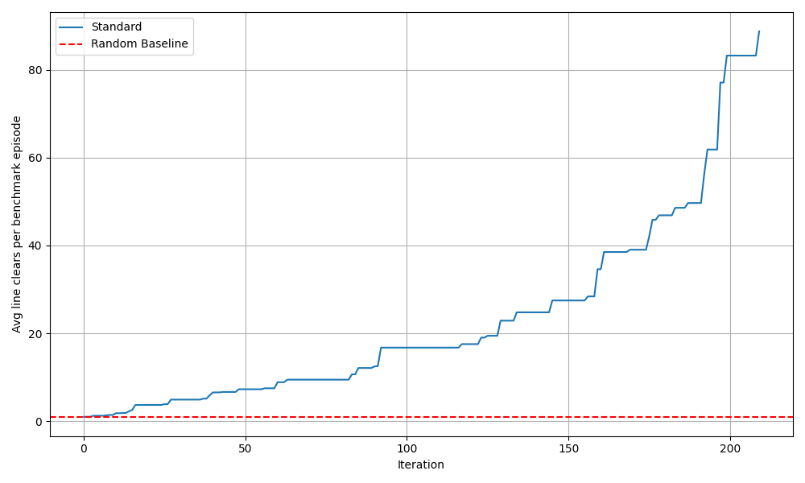
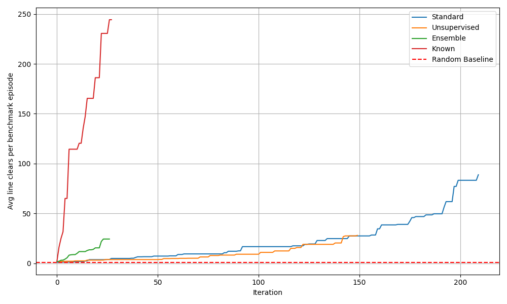

# AlphaTetris


This project implements a Deep Monte Carlo Tree Search agent, inspired by AlphaZero, that learns to play Tetris. The agent uses a residual neural network to guide its search and improve its policy and value estimates over time.

Two main modifications were introduced, augmenting the tree search policy to accelerate learning:
1. Biasing the search by altering the PUCT formula using a $\beta$-VAE. The VAE learns to extract meaningful features from the game state without supervision (i.e., without explicit labels) and is then modified to predict rewards.
2. Pruning actions not creating the minimum number of holes.

## Table of Contents
- [Features](#features)
- [Project Structure](#project-structure)
- [Installation](#installation)
- [Usage](#usage)
- [Docker](#docker)
- [Results](#results)
- [License](#license)

## Features

- **Deep MCTS Agent**: An agent that integrates Monte Carlo Tree Search (MCTS) with a deep neural network for self-play and learning. The base agent can be found in [`alpha_tetris/agents/deep_mcts_agent.py`](alpha_tetris/agents/deep_mcts_agent.py).
- **Efficient Inference**: Leverages `asyncio` to batch neural network requests from multiple concurrent MCTS simulations, maximising GPU throughput.
- **PyTorch-based ResNet model**: A custom ResNet architecture (`A0ResNet`) for policy and value prediction.
- **Experience Replay**: Stores game transitions in a buffer for model training.
- **Checkpointing**: Automatically saves and restores training progress.
- **Performance Benchmarking**: The agent benchmarks candidate models against the current best model to ensure monotonically increasing performance.
- **Docker Support**: Includes a [`Dockerfile`](Dockerfile) for easy setup and a reproducible environment with GPU support.

## Project Structure

The project is organised into a Python package (`alpha_tetris`) and several top-level configuration and documentation files.

```
alpha-tetris/
├── alpha_tetris/           # Main source code package
│   ├── agents/             # Orchestrates the training loop, MCTS and agent logic
│   ├── env/                # Game environment logic
│   ├── memory/             # Experience replay buffer
│   ├── models/             # Neural network architectures
│   ├── search/             # MCTS algorithms
│   ├── server/             # Inference server for efficient batching of requests
│   ├── training/           # Core training loop and logic
│   └── utils/              # Helper utilities
├── .gitignore              # Specifies files and directories to be ignored by Git
├── Dockerfile              # Definition of containerised environment
├── LICENSE                 # License information
├── poetry.lock             # Exact versions of installed dependencies
├── pyproject.toml          # Project dependencies and metadata
└── README.md               # This file
```

## Installation

This project uses [Poetry](https://python-poetry.org/) for dependency management.

1.  **Clone the repository:**
    ```bash
    git clone https://github.com/jsueling/alpha-tetris.git
    cd alpha-tetris
    ```

2.  **Install Poetry:**
    Follow the instructions on the [official Poetry website](https://python-poetry.org/docs/#installation).

3.  **Install dependencies:**
    This command will create a virtual environment and install all required packages from [`pyproject.toml`](pyproject.toml).
    ```bash
    poetry install
    ```

## Usage
To start the training process, run the `main.py` module from the `alpha_tetris` directory with the required arguments.

### Running the Training

Execute the script from within the Poetry environment:

```bash
poetry run python -m alpha_tetris.main -a <agent_type> -c <checkpoint_name>
```

### Command-Line Arguments

| Flag                | Argument          | Description                                                                                             | Required | Default |
| ------------------- | ----------------- | ------------------------------------------------------------------------------------------------------- | -------- | ------- |
| `--agent_type`, `-a`| `async`, `ensemble` | The type of Deep MCTS agent to train.                                                                   | Yes      | `None`  |
| `--checkpoint_name`, `-c`| `string`          | The base name for the checkpoint file. The agent type and seed will be appended to this name automatically. | Yes      | `None`  |
| `--seed`, `-s`      | `int`             | The random seed for reproducibility.                                                                    | No       | `42`    |

### Examples

**Train an asynchronous agent:**

```bash
poetry run python -m alpha_tetris.main -a async -c tetris_v1
```
This will start training with `DeepMCTSAgentAsync` and save checkpoints under the prefix `tetris_v1_async_seed_42`.

**Train an ensemble agent with a specific seed:**

```bash
poetry run python -m alpha_tetris.main -a ensemble -c tetris_v1 -s 123
```
This will start training with `DeepMCTSAgentEnsemble` and save checkpoints under the prefix `tetris_v1_ensemble_seed_123`.

```bash
poetry run python -m alpha_tetris.main --agent_type ensemble --checkpoint_name dmcts_v2 --seed 123
```
This will train `DeepMCTSAgentEnsemble` with a seed of 123, saving checkpoints under the prefix `dmcts_v2_ensemble_seed_123`.

### Display results
During training, results, state data, models and buffers are periodically saved to the `./out` directory under the checkpoint name. To view a summary of the training progress, you can run the following command:
```bash
poetry run python -m alpha_tetris.training.checkpoint
```

## Docker

For a more isolated and reproducible environment, you can use the provided [`Dockerfile`](Dockerfile).

1.  **Build the Docker image:**
    ```bash
    docker build -t alpha-tetris .
    ```

2.  **Run the container:**
    To leverage a GPU for training, ensure you have the [NVIDIA Container Toolkit](https://docs.nvidia.com/datacenter/cloud-native/container-toolkit/latest/install-guide.html) installed.

    ```bash
    # With GPU support
    docker run -it --gpus all --name tetris-container alpha-tetris

    # Without GPU support (CPU only)
    docker run -it --name tetris-container alpha-tetris
    ```

    This will open a bash shell inside the container where the environment is already set up. You can then run the training script as described in the [Usage](#usage) section.

## Results

The performance of the agents was evaluated via benchmark episodes throughout training. Due to computational constraints, the experiment did not run to completion. The unmodified Deep MCTS agent shows steady learning, with its average line clears consistently increasing over training iterations.


*Figure 1: Performance of the standard Deep MCTS agent over training iterations.*

A comparison of the different agent variants reveals the impact of the policy modifications. The agent using domain knowledge—by pruning actions that don't create the minimum number of holes—significantly dominates the other variants. In contrast, biasing the search, with the $\beta$-VAE feature extraction method, did not lead to a noticeable improvement over the baseline agent.


*Figure 2: Learning curve comparison between the standard agent, the biased search variant, the ensemble variant and the pruning variant.*

## License

This project is licensed under the MIT License. See the [LICENSE](LICENSE) file for details.
